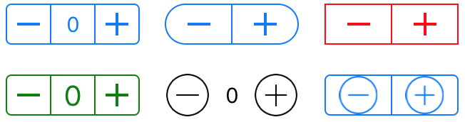

# Activity - Stepper View Control

In this activity you are going to create a Stepper view component which will allow the user to increment and decrement the values when the "+" or "-" buttons are clicked. One of the designs of the Stepper View control is shown below. You can use any colors, UI/UX you want for your Stepper control.  

* name your component Stepper 

Here are some sample designs for the Stepper View control. 

