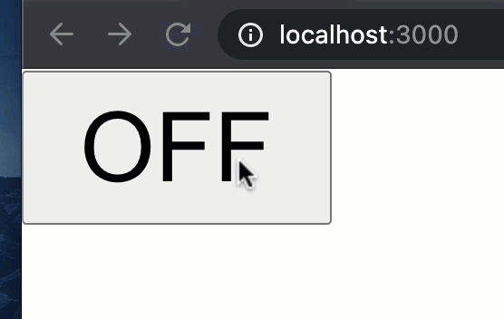

# Activity - Switch View 

In this activity you are going to create a Switch view. Switch view will consist of a button which can be turned on or off. 

Take a look at animation below:




You can use the tenary operator like this: 

```{this.state.isOn ? "ON" : "OFF"}```