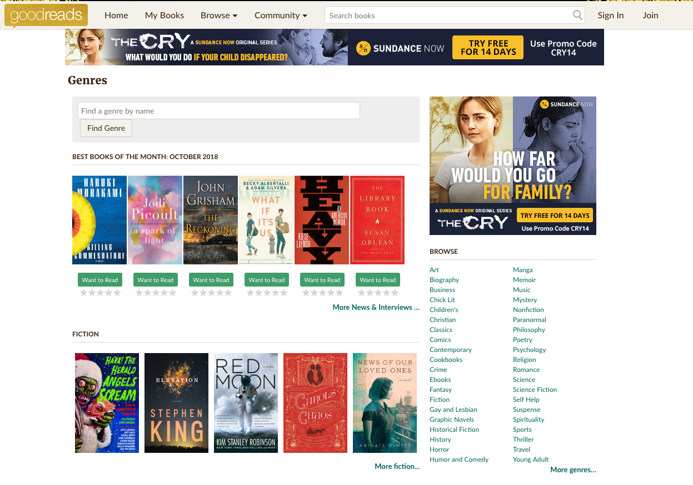

# Assignment - Book Barn Website

You are responsible to create the Book Barn website. Create React components for header, footer, main content, language etc. 

Your data will come from a JSON file which is hosted here: 

https://raw.githubusercontent.com/benoitvallon/100-best-books/master/books.json

**Example of Image URL**
https://raw.githubusercontent.com/benoitvallon/100-best-books/master/static/images/absalom-absalom.jpg

Below you can find a sample books website.

