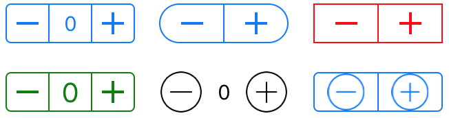

# Activity 1 - Stepper View Using Hooks

Create a Stepper View Using React Hooks. 

When the user presses the + button, the count is incremented. When the user presses the - button, the count is decremented. Show the count using a Label or H1. 

* name your component Stepper 

Here are some sample designs for the Stepper View control. 

