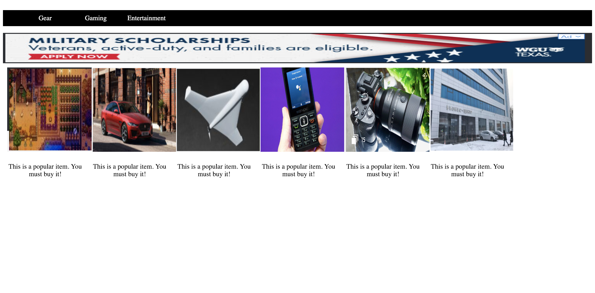

# Assignment - Engadget Responsive Website

In this assignment you are going to create a responsive Engadget website. Take a look at the screenshots to get an idea of the structure of the website for desktop as well as for mobile device. 

You can also watch the video of the final output: 

https://youtu.be/PxGgsGZp9UU

**Desktop**

**Mobile**
