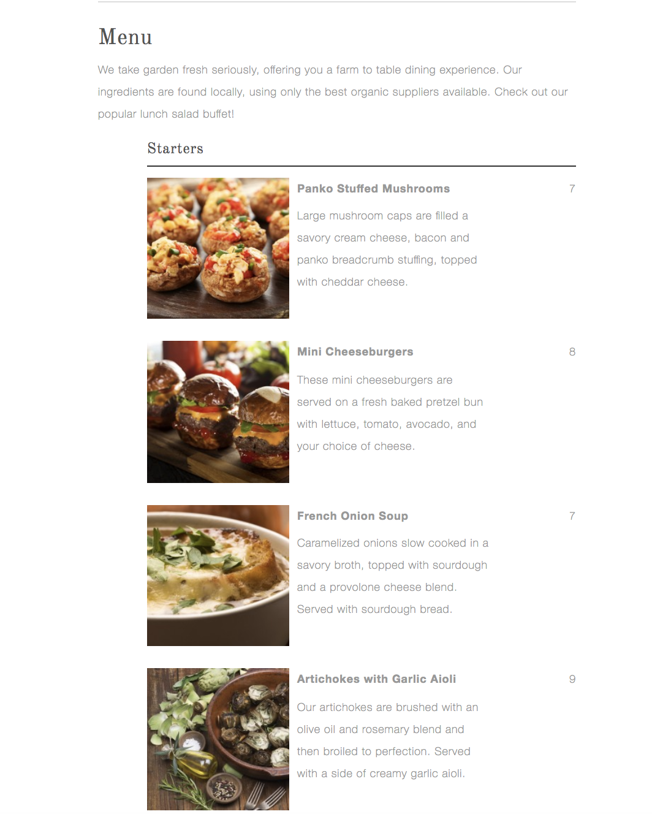

# Assignment - Restaurant Menu

Create a page which displays all the dishes on a web page. The listing will include the following: 
```
Title

Description

Price 

ImageURL (Display the image not the actual image URL) 
```
 
// OPTIONAL  // Research Array Helpers in JavaScript (filter, map) 

The page should also have an option to FILTER the dishes by course: 

Starters

Entrees

Desserts 

* Make sure the website is responsive on mobile devices. 

Example Layout Shown Below:




**Download the attached zip file**

https://gist.github.com/azamsharp/b8b0f8170a7c2f749b8b054cab18a362
