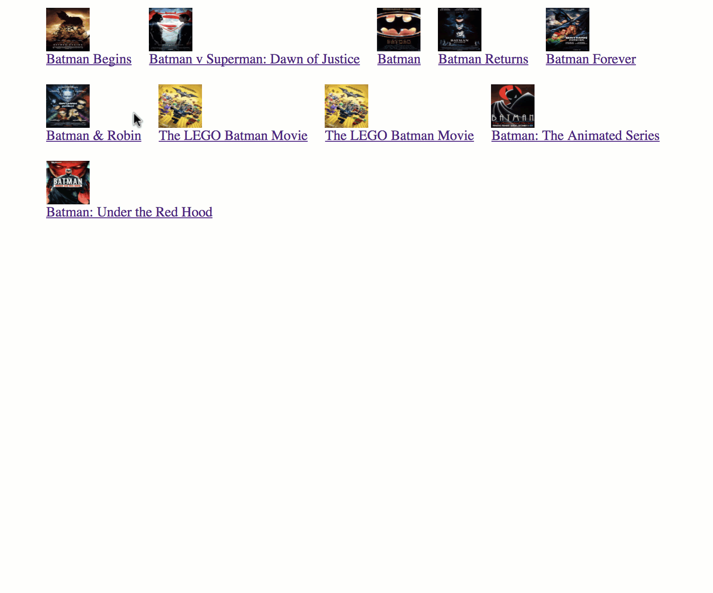

# Assignment - Super Heroes 

You have just been hired to create a page for super heroes. You will use the http://www.omdbapi.com/ API to get information related to your favorite super hero. 

OMDB API requires a key to be sent each time you are requesting a resource (url). 

The following URL will give you all the movies related to Batman: 

http://www.omdbapi.com/?s=batman&apikey=insertyourkeyhere

The following URL will give you details about the movie: 

http://www.omdbapi.com/?i=insertSelectedimdbIDhere&apikey=insertyourkeyhere 

 

Feel free to use your design skills to create an amazing experience. 

* Don't forget to make your website responsive

* You can also make your page take movie name input and then send it as part of the request. 

ONLY USE IF YOUR API KEY IS NOT GENERATED BY OMDB WEBSITE
http://www.omdbapi.com/?s=Batman&page=2&apikey=564727fa
