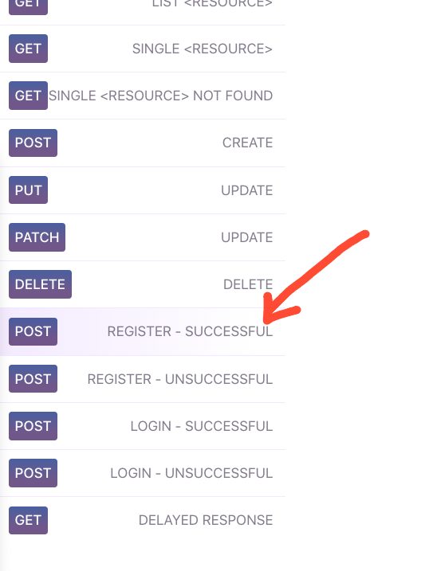

# Activity - POST 

In this activity you will use reqres.in service, which provides fake responses from the server. 

Create an app which takes email and password as input from the user and invoke the 

REGISTER SUCCESS (END POINT) (See attached screenshot) 

Display the response from the server on the screen. 

https://reqres.in/api/register 

