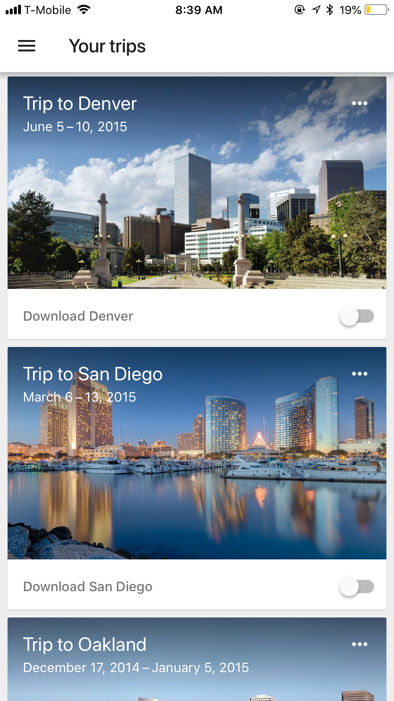

# Assignment - Trips

You are in charge of creating a website for tracking trips. You will use server side pages using Mustache or any other server side template framework for this assignment. 

Your app should allow users to do the following: 

- Ability to add a new trip. A new trip consists of title, image, date of departure, date of return (DO NOT UPLOAD IMAGES. JUST USE TEXTBOX TO ENTER THE URL TO AN IMAGE)

- Ability to view all the trips (A sample screenshot is shown below. Screenshot is just for demoing purposes you can design your app however you want) 

- Ability to delete a trip (Do this last, since deleting a trip is difficult. Hint - You can have multiple forms) 

* Your app should work on mobile devices 

* Google Trips is a good app for inspiration and ideas! (Available on the App Store)  

**HARDMODE:** 

- Ability to update the trip 

- Ability to sort the trip by date

- Ability to search for the trip by destination city

